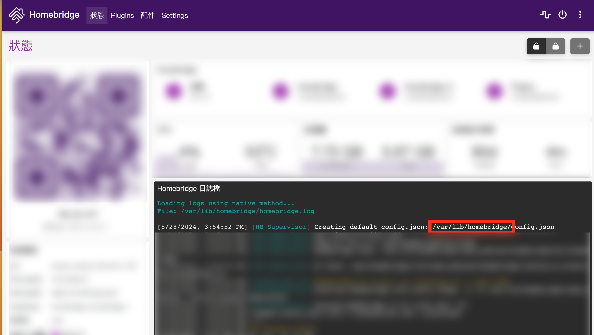
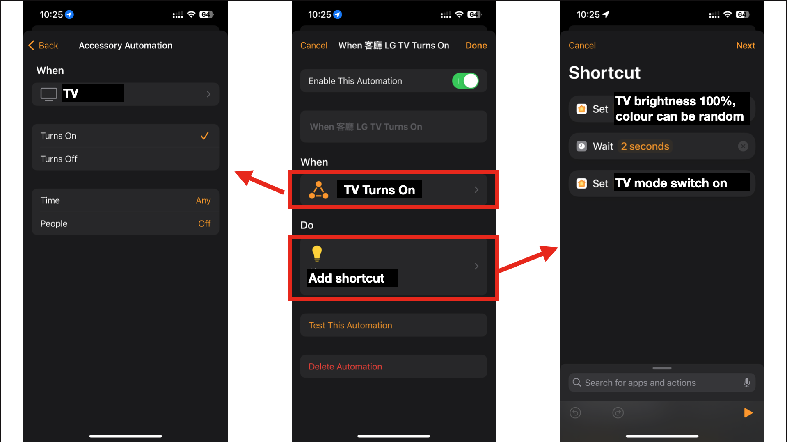
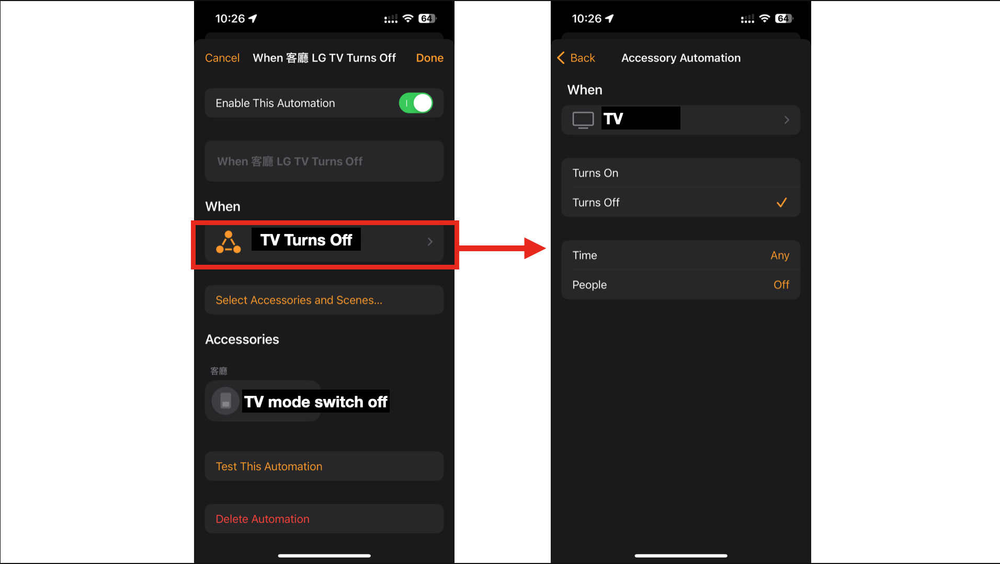

# Strip Light Homebridge Plugin
This is a Homebridge plugin for the Tuya Strip Light. It is based on the Tuya Homebridge Plugin.
The instructions for is based on install homebrdige on docker on a Synology NAS.

## Update
### 2023-12-22 v1.0.1
- Fixed issue: When you adjust the colour and brightness on the left panel, the mode on the right panel will not reset to "Colour" mode. You will need to click the switch twice to turn on the music(tv) mode.
- Fixed issue: If there are error message when adding the device/gateway to homekit, please comment the following line in index.js, and remove the comment after adding the device/gateway to homekit. This was because the UUID conflicts.

### 2023-12-23 v1.0.2
- Fixed issue: You are not able to adjust white light (Saturation isn't return from homekit) on Homekit using this plugin.
- Fixed issue: The relationship between the brightness and led status

### 2024-04-23 v1.0.3
- Fixed issue: Siri cannot turn the stipe light off when using prompt "turn off all the lights".

## Product
https://m.tb.cn/h.5mpecxX?tk=epnBW56D6sZ CZ0001 「电视氛围灯同步声光电视机氛围灯带随屏同步变色背景智能同步灯带」


## Features
- LEFT PANEL: Color adjustment, brightness adjustment (colour mode)
- RIGHT PANEL: Mode adjustment (colour, music(tv))
<br/>


## Installation
1. Install Tuya Homebridge Plugin as per instructions: https://developer.tuya.com/en/docs/iot/Tuya_Homebridge_Plugin?id=Kamcldj76lhzt
   <br><br>
2. Make a new share folder called "docker" on Synology Nas.
   <br><br>
3. Make a new folder inside folder "docker" called "homebridge" and upload the entire folder from this repo to the new folder.
   <br><br>
4. Check your Homebridge location in docker <br>
   Go to homekit dashboard, scroll to the top of the logs. Find "Creating default config.json" and copy the /...../homebridge/ location.
   
   <br><br>
5. Remove the original config file of "Tuya Homebridge Plugin" first (in this tutorial we rename it instead remove it)
   Replace the {YOUR_HOME_BRIDGE_LOCATION} with the location you copied in step 4.
   ```
    cd {YOUR_HOME_BRIDGE_LOCATION}/node_modules/homebridge-tuya-platform
    mv index.js index.js.backup
    ```
6. Configure the volume mapping in the docker container as follows and keeps the permission as READ and WRITE<br>
   Replace the {YOUR_HOME_BRIDGE_LOCATION} with the location you copied in step 4.
    ```
    /docker/homebridge/tuya-light-strip-main/lib/strip_light_mode_switch_accessory.js:{YOUR_HOME_BRIDGE_LOCATION}/node_modules/homebridge-tuya-platform/lib/strip_light_mode_switch_accessory.js
    /docker/homebridge/tuya-light-strip-main/lib/strip_light_accessory.js:{YOUR_HOME_BRIDGE_LOCATION}/node_modules/homebridge-tuya-platform/lib/strip_light_accessory.js
    /docker/homebridge/tuya-light-strip-main/index.js:{YOUR_HOME_BRIDGE_LOCATION}/node_modules/homebridge-tuya-platform/index.js
    ```
7. Go to the docker container terminal and run the following command to install the dependencies
    ```
    cd /var/lib/homebridge/node_modules/homebridge-tuya-platform
    npm install @tuya/tuya-panel-protocols
    ```
   <br><br>
8. Restart the docker container.


## Development
1. You can connect IDE to the synology nas using FTP.
2. After editing file, you can restart homebridge to see the changes.


## Automation
If you will like to setup a automation to turn on the strip light and set it to "music mode" when the TV is on(and put it back to "colour mode" when the TV is off), you can use the following code in the automation. Please add these two senses to your homekit:
NOTES: 
- Your TV should be connected to Homekit to use this automation.
- "TV Mode Switch" in the following diagram indicates the switch on the right panel(mode adjustment) of the strip light.
- It is important to add a delay in the shortcut, otherwise homebridge will crash.
<br/><br/>

**When TV is on**
<br/><br/>

<br/>

**When TV is off**
<br/><br/>

<br/>


## Acknowledgements
- 照明协议工具 https://developer.tuya.com/cn/docs/iot/lampProtocol?id=Kaljp68841zwl
- 开发 Homebridge 硬件驱动 https://developer.tuya.com/cn/docs/iot/add-category?id=Kavr81qw3t4p8
- 如何安装涂鸦 Homebridge 插件 https://developer.tuya.com/cn/docs/iot/Tuya_Homebridge_Plugin?id=Kamcldj76lhzt
- Tuya Homebridge Plugin https://github.com/tuya/tuya-homebridge
- Homebridge API https://developers.homebridge.io/
- [NEW] HSV 計算工具：https://web.cs.uni-paderborn.de/cgvb/colormaster/web/color-systems/hsv.html